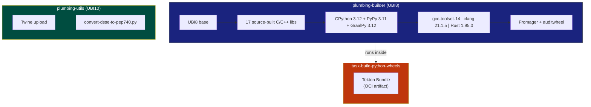

# Plumbing: Container Images

```mermaid
graph TD
    subgraph builder["plumbing-builder (UBI8)"]
        UBI8["UBI8 base"] --> Libs["17 source-built C/C++ libs"]
        Libs --> Python["CPython 3.12 + PyPy 3.11 + GraalPy 3.12"]
        Python --> Tools["gcc-toolset-14 | clang 21.1.5 | Rust 1.95.0"]
        Tools --> Fromager["Fromager + auditwheel"]
    end
    subgraph utils["plumbing-utils (UBI10)"]
        Twine["Twine upload"] ~~~ PEP740["convert-dsse-to-pep740.py"]
    end
    subgraph bundle["task-build-python-wheels"]
        OCI["Tekton Bundle<br>(OCI artifact)"]
    end
    builder -.->|runs inside| bundle

    style builder fill:#1a237e,color:#fff
    style utils fill:#004d40,color:#fff
    style bundle fill:#bf360c,color:#fff
```

!!! note ""

    **~2,000-line Containerfile** with 20+ intermediate stages. Builder image compiles everything from source for full supply chain control.
