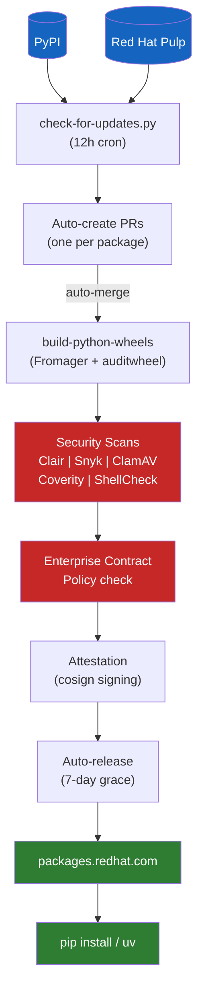

# End-to-End Flow

```mermaid
flowchart TD
    PyPI[(PyPI)] --> Cron["check-for-updates.py<br>(12h cron)"]
    Pulp[(Red Hat Pulp)] --> Cron
    Cron --> PRs["Auto-create PRs<br>(one per package)"]
    PRs -->|auto-merge| Build["build-python-wheels<br>(Fromager + auditwheel)"]
    Build --> Scan["Security Scans<br>Clair | Snyk | ClamAV<br>Coverity | ShellCheck"]
    Scan --> ECP["Enterprise Contract<br>Policy check"]
    ECP --> Sign["Attestation<br>(cosign signing)"]
    Sign --> Release["Auto-release<br>(7-day grace)"]
    Release --> Registry["packages.redhat.com"]
    Registry --> Users["pip install / uv"]

    style PyPI fill:#1565c0,color:#fff
    style Pulp fill:#1565c0,color:#fff
    style Registry fill:#2e7d32,color:#fff
    style Users fill:#2e7d32,color:#fff
    style Scan fill:#c62828,color:#fff
    style ECP fill:#c62828,color:#fff
```
