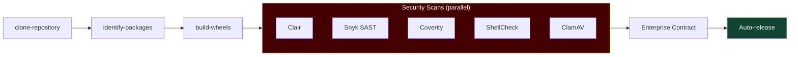

# Index Build Pipeline

-   __Build Resources__{ style="color:#009596;" }

    ---

    - **Memory:** 20GB for wheel builds
    - **Task:** `build-python-wheels-oci-ta`
    - **Image:** pinned by SHA256 digest

-   __Output__{ style="color:#009596;" }

    ---

    - IMAGE_URL - built wheel OCI artifact
    - IMAGE_DIGEST - SHA256 of artifact
    - GIT_COMMIT - source commit hash

