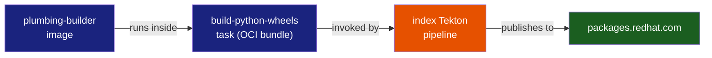
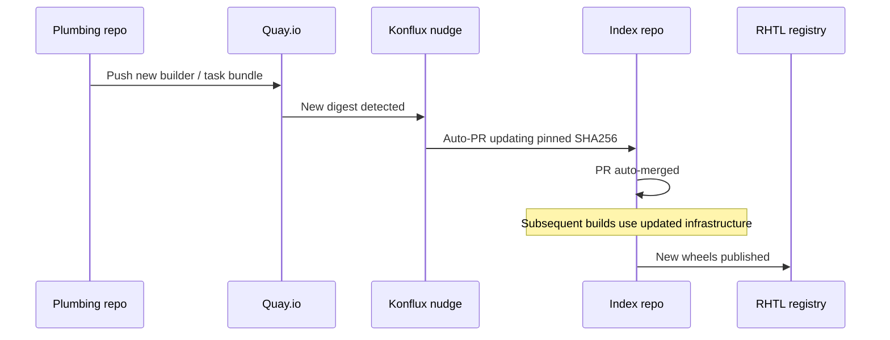

# How Repos Work Together

### Dependency Chain

```mermaid
flowchart LR
    A["plumbing-builder<br>image"] -->|runs inside| B["build-python-wheels<br>task (OCI bundle)"]
    B -->|invoked by| C["index Tekton<br>pipeline"]
    C -->|publishes to| D["packages.redhat.com"]

    style A fill:#1a237e,color:#fff
    style B fill:#1a237e,color:#fff
    style C fill:#e65100,color:#fff
    style D fill:#1b5e20,color:#fff
```

### Update Propagation

```mermaid
sequenceDiagram
    participant P as Plumbing repo
    participant Q as Quay.io
    participant N as Konflux nudge
    participant I as Index repo
    participant R as RHTL registry

    P->>Q: Push new builder / task bundle
    Q->>N: New digest detected
    N->>I: Auto-PR updating pinned SHA256
    I->>I: PR auto-merged
    Note over I: Subsequent builds use updated infrastructure
    I->>R: New wheels published
```
